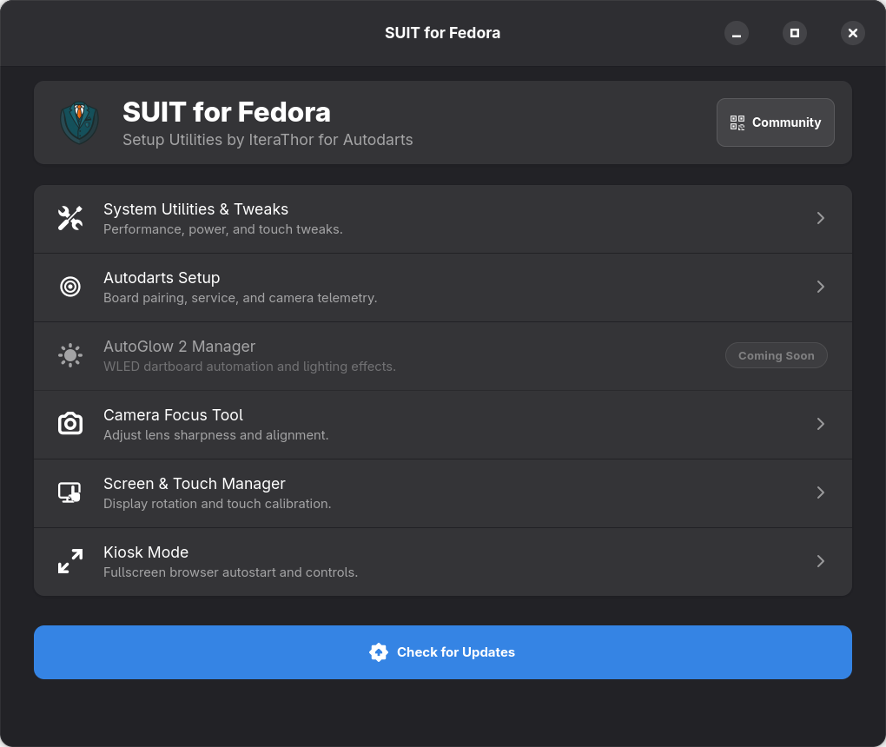
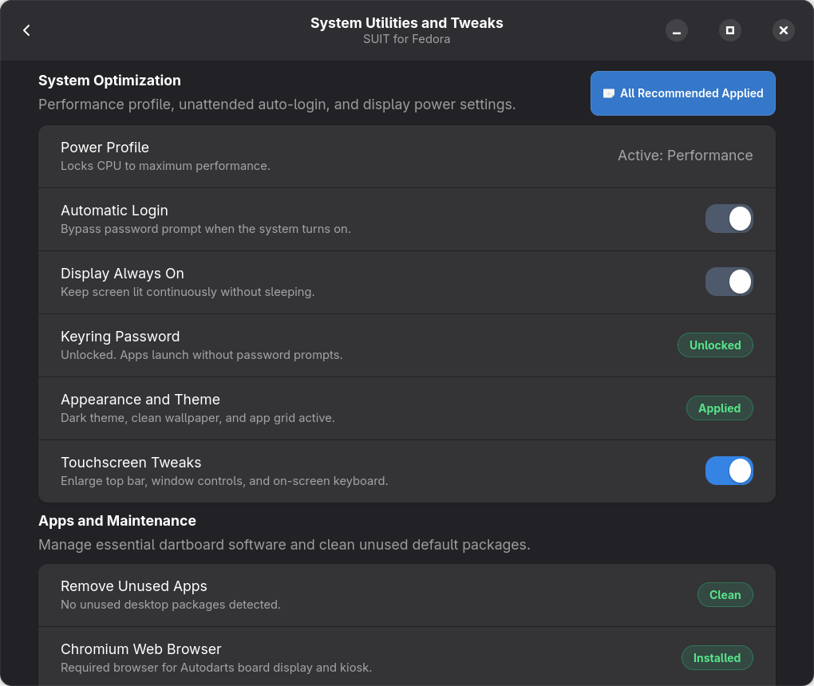
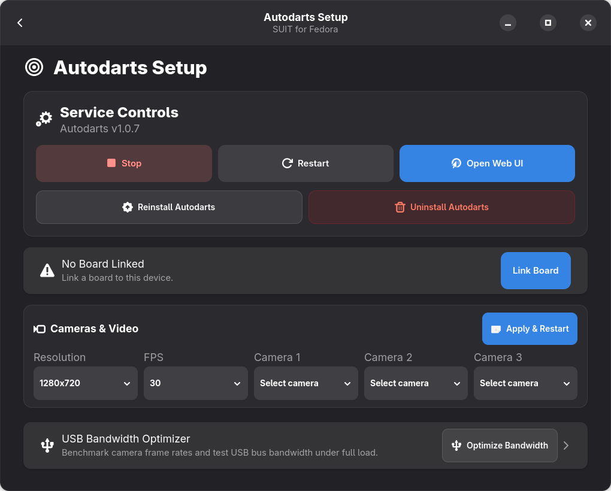
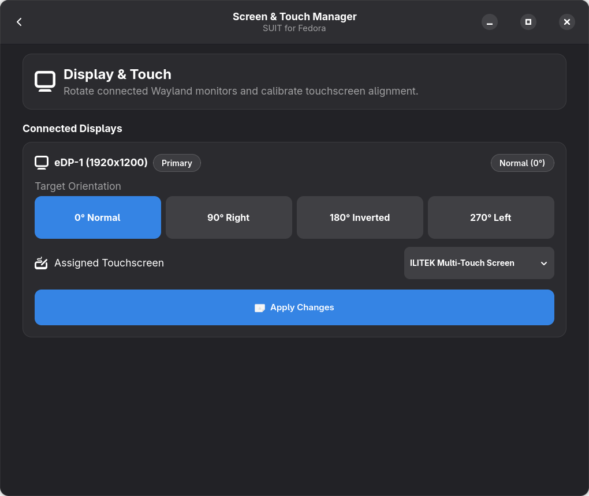
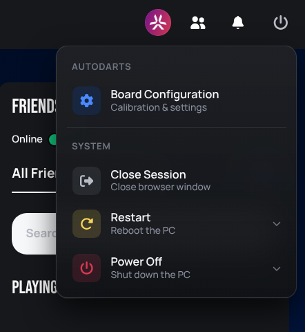

<div align="center">
  
  <h1>SUIT for Fedora</h1>
  <p><strong>Setup Utilities by IteraThor for Autodarts on Fedora Linux</strong></p>
</div>

---

## Quick Install

To install SUIT, copy and run this single command in your terminal:

```bash
git clone https://github.com/IteraThor/SUIT.git && cd SUIT && chmod +x install.sh && ./install.sh
```

Launch **SUIT for Fedora** directly from your application menu or Dash favorites once installed.

---

## Upgrading from Old SUIT (Cleanup & Uninstall)

If you have an older installation of SUIT (Tkinter / Ubuntu edition), run this one-line command to remove legacy background services, outdated autostarts, and old touch rules:

```bash
curl -sSL https://raw.githubusercontent.com/IteraThor/SUIT/main/uninstall_legacy.sh | bash
```

*(Or run `./uninstall_legacy.sh` from within the cloned SUIT directory).*

This automatically cleans:
* Legacy background services (`suit-killswitch.service`, `autoglow.service`).
* Legacy touch rotation rules (`/etc/udev/rules.d/99-suit-touch.rules`).
* Old autostart entries (`suit-rotation.desktop`, `suit-chromium.desktop`).
* Outdated desktop launchers.

---

## Features & Modes

### 1. Main Dashboard
Modern Libadwaita touch menu providing rapid access to all system tools and live status.

<div align="center">
  
</div>

* Large 48px+ touch targets optimized for touchscreens.
* Quick access to community resources, Discord, and 3D print models.
* Integrated one-click update checker.

---

### 2. System Utilities & Touchscreen Tweaks
One-click performance, display, and desktop optimizations for dartboard machines.

<div align="center">
  
</div>

* **Touchscreen Tweaks**: Enlarges GNOME top bar to 54px, expands button touch padding, enables On-Screen Keyboard (OSK), and restores window Minimize/Maximize buttons across Chromium and desktop apps.
* **Performance Profile**: Locks CPU governors to high-performance mode to minimize dart detection latency.
* **Display Keepalive & Auto-Login**: Bypasses screen blanking, sleep timeouts, and login password prompts.

---

### 3. Autodarts Setup
Manage the Autodarts core service daemon, camera configurations, and board pairing.

<div align="center">
  
</div>

* One-tap service controls to start, stop, or restart `autodarts.service`.
* Live camera selection with resolution and frame rate adjustments (up to 1080p, 30 FPS).
* Direct board pairing wizard and local web UI launcher.

---

### 4. Camera Focus Tool
Optical calibration wizard to achieve razor-sharp focus across all 3 Autodarts cameras.

* **Sweet-Spot HUD**: Projects a green target reticle directly onto the furthest double ring wire.
* **2.5x Magnifier Lens**: Live zoomed view centered on the sweet spot for fine optical lens adjustments.
* **Sharpness Score Meter**: Normalized 0–100 score gauge with real-time peak tracking and focus trend indicators.
* **Audio Tone Guidance**: Modulates pitch dynamically as focus improves, allowing you to focus lenses while standing at the board without looking at the screen.

---

### 5. Screen & Touch Manager
Wayland display orientation and touch coordinate matrix calibration.

<div align="center">
  
</div>

* Rotate displays seamlessly between 0° Normal, 90° Right, 180° Inverted, and 270° Left.
* Automatic touch matrix calibration (`LIBINPUT_CALIBRATION_MATRIX`) via udev rules to align touch input with rotated screens.
* Discovers connected displays and touchscreen controllers automatically.

---

### 6. Fullscreen Kiosk Mode
Run Autodarts as a dedicated full-screen appliance with customized browser controls.

<div align="center">
  
</div>

* Boots Chromium directly into fullscreen mode without desktop distractions.
* Toggle automatic autostart on boot.
* Built-in Chromium extension adding Power, Reboot, and Exit buttons directly into the Autodarts web scoreboard.
